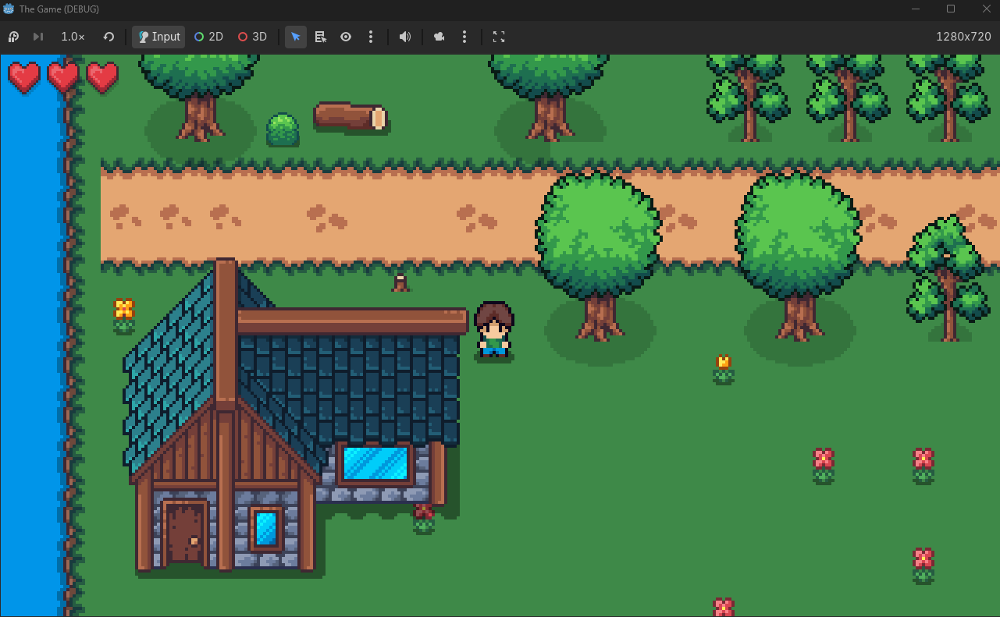

# Ethry

A 2D top-down adventure game built with Godot 4.6 and C#.

## Features

- Player movement and animation
- Attack system with hitbox detection
- Resource gathering (Wood, Stone, Herbs)
- Inventory system for item pickups
- Pixel art style

## Getting Started

1. Open the project in Godot 4.6 (.NET version)
2. Build the C# solution
3. Run the project

## Credits

* **Game Developer:** Mehdi Lakhouane
* **Art & Assets:** Powered by the beautiful [Cute Fantasy RPG](https://kenmi-art.itch.io/cute-fantasy-rpg) series and expansions created by **Kenmi** on itch.io.
